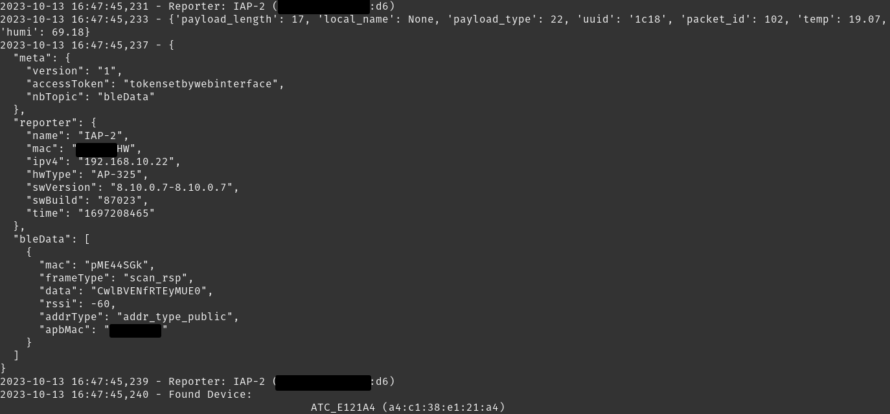

# aruba2mqtt

## Installation

Create protbuf files
- Download [protoc](https://github.com/protocolbuffers/protobuf/releases)

``` text
git submodule update --init --recursive

./protoc -I=./aos8-iot-server-example-websocket/proto_files/source/ --python_out=. --pyi_out=./ ./aos8-iot-server-example-websocket/proto_files/source/aruba-iot-* 

pip3 install -r requirements.txt
```

## Usage
```
python3 main.py
```

### Demo



### Home Assistant MQTT Configuration
`configuration.yaml`
```
mqtt:
  - sensor:
      name: "ATC_XXXXXX Temperature"
      state_topic: "aruba2mqtt/ATC_XXXXX/state"
      unit_of_measurement: "°C"
      icon: "mdi:thermometer"
      value_template: "{{ value_json.temperature | round(1) }}"

  - sensor:
      name: "ATC_XXXXXX Humidity"
      state_topic: "aruba2mqtt/ATC_XXXXXX/state"
      unit_of_measurement: "%"
      icon: "mdi:water-percent"
      value_template: "{{ value_json.humidity | round(1) }}"
```